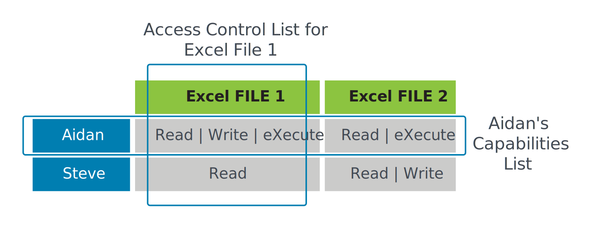

Chapter 3 Access Control Concepts
---------
## Module 1: Understand Access Control Concepts
### Controls Overview
Access controls are not just about restricting access to information systems and data, but also about allowing access.
It is about **granting the appropriate level of access to authorized personnel and processes** and **denying access to unauthorized functions or individuals**.
#### Subjects
* Entity that requests access to our assets
* Is a **user, a process, a procedure, a client** (or a server), a program, a device such as an endpoint, workstation, smartphone or removable storage device with onboard firmware.
* **Is active**: It **initiates** a request for access to resources or services.
* **Requests** a service from an object.
* Should have a level of clearance (permissions) that relates to its ability to successfully access services or resources.

### Controls Assessments
Risk reduction depends on the effectiveness of the control. It must apply to the current situation and adapt to a changing environment. 

### Defense in Depth
An information security **strategy** that **integrates people, technology and operations capabilities** to establish 
variable **barriers** across multiple layers and missions of the organization.

### Principle of Least Privilege
The Principle of Least Privilege is a **standard of permitting only minimum access necessary for users or programs** to fulfill their function. 
Users are provided access only to the systems and programs they **need to perform their specific job or tasks**. 

### Privileged Accounts
Account with permissions beyond those of normal users, such as managers and administrators. 
Example:
* Systems administrators
* Help desk or IT support staff
* Security analysts

Typical measures used for moderating the potential for elevated risks from misuse or abuse of privileged accounts include the following: 
* **More extensive and detailed logging** than regular user accounts
* **More stringent access control** than regular user accounts (MFA, Just-in-time, more rigorous authentication)
* **Deeper trust verification** than regular user accounts. Privileged account holders should be subject to more detailed **background checks**
* **More auditing** than regular user accounts. Privileged account activity should be **monitored and audited at a greater rate** and extent than regular usage. 

### Segregation of Duties
* No one person should control an entire high-risk transaction from **start to finish**.
* Two-Person Integrity: Minimum of two people to be in an area together, making it impossible for a person to be in the area alone.(Reduce insider threats)

### How Users Are Provisioned
Other situations that call for provisioning **new user accounts or changing privileges** include:
* **A new employee**: When a new employee is hired, the hiring manager sends a request to the security administrator to create a new user ID. 
* **Change of position**: New privilege while any access that is no longer needed in the new job will be removed. 
* **Separation of employment**: When employees leave the company, depending on company policy and procedures, their accounts must be disabled after the termination date and time.

## Module 2: Understand Physical Access Controls
### What Are Physical Security Controls? 
Physical access controls are mechanisms deployed to prevent, monitor or detect direct contact with systems or areas within a facility.

#### Badge Systems and Gate Entry
* Turnstiles: A one-way spinning door or barrier that allows only one person at a time to enter a building or pass through an area.
* Mantraps: An entrance to a building or an area that requires people to pass through two doors with only one door opened at a time.

#### Environmental Design
Crime Prevention through Environmental Design (CPTED) passive approach to design buildings and spaces to reduce likelihood of criminal activity.

#### Biometrics
Two processes:
* **Enrollment**: The user’s registered biometric code is either stored in a system or on a smart card that is kept by the user.
* **Verification**: The user presents their biometric data to the system so that the biometric data can be compared with the stored biometric code.

May not be secret, it is personally identifiable. Biometrics takes two primary forms, physiological and behavioral.
* **Physiological**: Fingerprint, iris, palm scan
* **Behavioral**: Voiceprints, signature dynamics and keystroke dynamics

### Monitoring
Cameras, security guards, Alarm Systems and logs

## Module 3: Understand Logical Access Controls
### What Are Logical Security Controls? 
Electronic methods that limit someone from getting access to systems, and sometimes even to tangible assets or areas. Types of logical access controls include: 
* Passwords
* Biometrics (implemented on a system, such as a smartphone or laptop)
* Badge/token readers connected to a system

### Discretionary Access Control (DAC)
A certain amount of access control is left to the discretion of the object's owner, or anyone else who is authorized to control the object's access.
Enforced over all subjects and objects in an information system.
In DAC, the policy specifies that a subject who has been granted access to information can do one or more of the following:
* **Pass** the information to other subjects or objects 
* **Grant its privileges** to other subjects 
* **Change security attributes** on subjects, objects, information systems or system components 
* Choose the security attributes to be associated with **newly created or revised objects**; and/or 
* **Change the rules governing access control**; mandatory access controls restrict this capability 

#### DAC Example:

### Mandatory Access Control (MAC)
Only properly designated *security administrators*, as *trusted* subjects, can *modify any of the security rules* that are established for subjects and objects within the system. 
Subject is *constrained* from doing any of the following
* Passing the information to unauthorized subjects or objects 
* Granting its privileges to other subjects 
* Changing one or more security attributes on subjects, objects, the information system or system components 
* Choosing the security attributes to be associated with newly created or modified objects 
* Changing the rules governing access control 

### DAC vs MAC
Although MAC sounds very similar to DAC, the primary difference is who can control access. With Mandatory Access Control, 
it is mandatory for **security administrators to assign access rights or permissions**; with Discretionary Access Control, it is up to the object owner’s discretion. 

#### Role-Based Access Control  (RBAC)
As the name suggests, sets up user permissions based on roles. Each role represents users with similar or identical permissions.  
