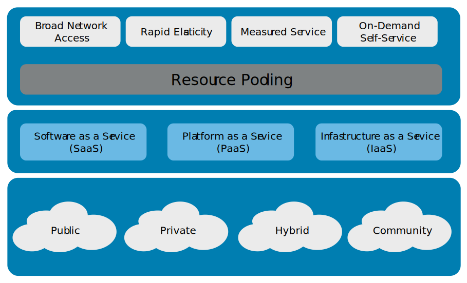

Chapter 4 Network Security
---------

## Module 1: Understand Computer Networking
### What is Networking
A network is simply **two or more computers linked together** to share data, information or resources.

### Types of Networks
* Local area network (LAN) - A network typically spanning a single floor or building. This is commonly a limited geographical area.
* Wide area network (WAN) - Long-distance connections between geographically remote networks.

### Network Devices
* Hub: Hubs are used to connect multiple devices in a network, not smart.
* Switch: Intelligent hub know the addresses of the devices connected to them and route traffic to that port/device rather than broadcast. Can create VLANs
* Router: Connect similar networks and control traffic flow between them. Connect multiple switches.
* Firewall: Controlling (filter) network traffic and protecting the network.
* Server: Provides information to other computers on a network. 
* Endpoints: Client

### Networking Models
Those simple goals can be re-expressed in network (and security) terms such as:
* Provide reliable, managed communications between hosts (and users)
* Isolate functions in layers
* Use packets as the basis of communication
* Standardize routing, addressing and control
* Allow layers beyond internetworking to add functionality
* Be vendor-agnostic, scalable and resilient

### Open Systems Interconnection (OSI) Model
* To establish a **common way** to describe the communication structure for interconnected computer systems.
* Theoritical model, abstract framework

Example:
* When someone references an image file like a JPEG or PNG, we are talking about the Presentation Layer (6). 
* When discussing logical ports such as NetBIOS, we are discussing the Session Layer (5).
* When discussing TCP/UDP, we are discussing the Transport Layer (4).
* When discussing routers sending packets, we are discussing the Network Layer (3). 
* When discussing switches, bridges or WAPs sending frames, we are discussing the Data Link Layer (2). 
* Physical Layer (1) the data unit is converted into binary, i.e., 01010111

#### Terminology
* **Payload**: The primary action of a malicious code attack.
* **Encapsulation**: Bundling data and methods, can also refer as packing or hiding in another data structure.
* **de-encapsulation**: The opposite process of encapsulation, in which bundles of data are unpacked or revealed.

### TCP/IP
* Most widely used protocol
* Developed in the early 1970s
* A protocol stack comprising dozens of individual protocols
* Consume a lot resources
* Easy to hack as designed for ease of use only
* TCP: full-duplex connection-oriented protocol
* UDP: simplex connectionless protocol

Layer | Description |
------|-------------|
Application Layer | Defines the protocols for the transport layer |
Transport Layer | Permits data to move among devices |
Internet Layer  | Creates/inserts packets |
Network Interface Layer | How data moves through the network |

### Internet Protocol (IPv4 and IPv6)
IPv4:
* 32-bit
* Not enough addresses
* 127.0.0.1 is reserved for loopback
* IPsec is optional

Private IP:
Range |
------|
10.0.0.0 to 10.255.255.254 |
172.16.0.0 to 172.31.255.254  |
192.168.0.0 to 192.168.255.254  |

IPv6:
* 128-bit
* Solution for not enough addresses
* Improved security as IPsec is mandatory
* Can be shorten: 2001:0db8:0000:0000:0000:ffff:0000:0001 -> 2001:db8::ffff:0:1

### Security of the Network
* DDoS attack: The **prevention of authorized access to resoures** or the delaying of time-critical operations
* Fragment attack: An attacker **fragments traffic** in such a way that a system is **unable to put data packets back together**.
* Purposely sending a network packet that is **larger than can be handled** by the receiving system, causing the receiving system to **fail** unexpectedly.
* MITM attack: An attacker where positions himself **in between the user and the system** so that he can **intercept and alter** data travelling between them.
* Sniffing: Passive, act of **monitoring traffic patterns** to obtain information about a network.

### Ports and Protocols (Applications/Services)
* Physical Ports: On routers, switches, servers, computers, etc
* Logical ports: 
	* Used between two systems to communicate or establish connection
	* Socket: ip address + port 
	* Port: Allow multiple simultaneous communications for single IP
	* **Well-known (0-1023)**: Common protocols. e.g. SMTP, DNS, SSH
	* **Registered ports (1024-49151)**: Proprietary applications from vendors and developers.Approved by IANA.
	* **Dynamic or private ports (49152-65535)**: Used for connecting well-known or registered ports.Released once session ends.
	
### Secure Ports
* Some network protocols transmit information in clear text
* Not encrypted

Insecure Port | Description | Protocol | Secure Alternative | Protocol |
--------------|-------------|----------|--------------------|----------|
21 - FTP | Sends the username and password using plaintext | File Transfer Protocol | 22 - SFTP | Secure File Transfer Protocol |
23 - Telnet | Not encrypted (Plaintext) | Telnet | 22 - SSH | Secure Shell |
25 - SMTP | Unencrypted port for sending email messages | Simple Mail Transfer Protocol | 587 - SMTP | SMTP with TLS |
37 - Time | Legacy. NTP has better error-handling and reduces likelihood of unexpected erros | Time Protocol | 123 - NTP | Network Time Protocol |
53 - DNS | Not encrypted (Plaintext) | Domain Name Service | 853 - DoT | DNS over TLS (DoT) |
80 - HTTP | Not encrypted (Plaintext) | HyperText Transfer Protocol | 443 - HTTPS | HyperText Transfer Protocol (SSL/TLS) |
143 - IMAP | retrieving emails, not encrypted (Plaintext) | Internet Message Access Protocol | 993 - IMAP | 	IMAP for SSL/TLS |
161/162 - SNMP | used for managing infrastructure devices, it is recommended to use SNMP version 2 or 3 to include encryption and additional security features. | Simple Network Management Protocol | 161/162 - SNMP | SNMPv3 |
445 - SMB | Files are transmitted unencrypted, and many vulnerabilities are well-known | Server Message Block |  Block	2049 - NFS | Network File System |
389 - LDAP | Used to communicate directory information from servers to clients, not encrypted | Lightweight Directory Access Protocol | 636 - LDAPS | 	Lightweight Directory Access Protocol Secure |

## Module 2: Understand Network (Cyber) Threats and Attacks
### Types of Threats
* **Spoofing**: **Gaining access** to a target system through the use of a **falsified identity**. E.g.  IP addresses, MAC address, usernames, system names, wireless network SSIDs, email addresses
* **Phising**: Attempts to **misdirect legitimate users** to **malicious websites** through the abuse of URLs or hyperlinks in emails could be considered phishing.
* **DoS/DDoS**: Network resource consumption attack that has the primary goal of preventing legitimate activity on a victimized system.
* **Virus**: Propagation and destruction. A virus is a **self-replicating** piece of code that spreads **without the consent** of a user, but frequently with their assistance (a user has to **click** on a link or **open** a file). 
* **Worm**: They propagate themselves without requiring any human intervention.
* **Trojan**: A software program that **appears benevolent** but carries a **malicious payload** that has the potential to wreak havoc on a system or network
* **On-path Attack**: Aka MITM, attackers place themselves **between** two devices, to **intercept or modify** information
* **Side-channel**: Passive, noninvasive attack to **observe** the operation of a devices
* **Advanced persistent threat (APT)**:  Threats that demonstrate an unusually **high level of technical** and operational sophistication spanning **months or even years**
* **Insider Threat**: Treats from individuals who are trusted by the organization. Not always willing participants, like fell for a scam
* **Malware**: A program that is inserted into a system, to compromise CIA
* **Ransomware**: Use cryptography to "lock" the files, require payment of a ransom fee to "unlock"

### Intrusion Detection System (IDS)
* Monitors recorded information and real-time events to **detect abnormal activity** indicating a potential incident or intrusion
* Automates the inspection of logs
* Part of a defense-in-depth security plan
* Complement firewalls but not replace them
* Recognize attacks that come from external connections (Internet)
* Respond by sending alerts or raising alarms
* Host-based or Netowrk-based

### Preventing Threats
* Keep systems and applications up to date. 
* Remove or disable unneeded services and protocols.
* Use intrusion detection and prevention systems.
* Use up-to-date anti-malware software.
* Use firewalls.

## Module 3: Understand Network Security Infrastructure
### Redundancy
* Duplicate components so that if a failure were to occur, there would be a backup
* Example two power supplies connected to diverse power sources

### Memorandum of Understanding (MOU)/Memorandum of Agreement (MOA) 
* To minimize downtime and enhance BC (Business Continuity) and DR (Disaster Recovery) capabilities
* If one of the parties experiences an emergency and cannot operate within their own facility, the other party will share its resources
* These agreements are called joint operating agreements (JOA) or MOA/MOU

### Cloud

* Cloud computing is usually associated with an internet-based set of computing resources, and typically sold as a service, provided by a cloud service provider (CSP). 

#### Characteristics
* Usage is metered and priced according to units (or instances) consumed
* Reduced cost of ownership. No need to buy any assets for everyday use, No loss of asset value over time, no maintenance and support cost
* Reduced energy and cooling cost
* Allows an enterprise to scale up new software or data-based services/solutions through cloud systems quickly and without having to install massive hardware locally

#### Service Models
* SaaS:  A cloud provides access to software applications such as email or office productivity tools.
* PaaS: A cloud provides an environment for customers to use to build and operate their own software. 
* IaaS: A cloud provides network access to traditional computing resources such as processing power and storage. 

#### Deployment Models
* Public: Open to the public
* Private: Developed and deployed for a private organization that builds its own cloud.
* Hybrid: combining two forms of cloud computing deployment models, typically a public and private cloud.
* Community: Community clouds can be either public or private.

#### Managed Service Provider (MSP)
* Manages information technology assets for another company.
* Manage day-to-day operations or to provide expertise.
* May provide network and security monitoring and patching services.
* Managed detection and response (MDR) service, where a vendor monitors firewall and other security tools to provide expertise in triaging events.

#### Service-Level Agreement (SLA)
* An agreement between a cloud service provider and a cloud service customer with cloud specific terms
* Characterizes quality of the cloud services delivered in terms of a set of measurable properties:
	* Cloud system infrastructure details and security standards
	* Customer right to audit legal and regulatory compliance by the CSP         
	* Rights and costs associated with continuing and discontinuing service use
	* Service availability
	* Service performance
	* Data security and privacy
	* Disaster recovery processes
	* Data location
	* Data access
	* Data portability
	* Problem identification and resolution expectations
	* Change management processes
	* Dispute mediation processes
	* Exit strategy 

### Network Design
* **Network Segmentation**: **Isolated** from all outside communications, transactions can **only occur between devices within the segmented network**.
* **Demilitarized Zone (DMZ)**: Designed to be accessed by **outside visitors** but is still **isolated from the private network** of the organization.
* **VLAN**: VLANs are created by switches to **logically segment a network** without altering its physical topology.
* **VPN**: **Communication tunnel** that provides **point-to-point transmission of both authentication and data traffic over an untrusted network.
* **Defense in Depth**: Multiple types of access controls in literal or theoretical layers to help an organization avoid a monolithic security stance.
* **NAC**: A concept of controlling access to an environment through strict adherence to and implementation of security policy.

#### Defense in Depth
* **Data**: Controls that protect the actual data with technologies such as encryption, data leak prevention, identity and access management and data controls.
* **Application**: Controls that protect the application itself with technologies such as data leak prevention, application firewalls and database monitors.
* **Host**: Every control that is placed at the endpoint level, such as antivirus, endpoint firewall, configuration and patch management.
* **Internal network**: Controls that are in place to protect uncontrolled data flow and user access across the organizational network. Relevant technologies include intrusion detection systems, intrusion prevention systems, internal firewalls and network access controls.
* **Perimeter**: Controls that protect against unauthorized access to the network. This level includes the use of technologies such as gateway firewalls, honeypots, malware analysis and secure demilitarized zones (DMZs).
* **Physical**: Controls that provide a physical barrier, such as locks, walls or access control.
* **Policies, procedures and awareness**: Administrative controls that reduce insider threats (intentional and unintentional) and identify risks as soon as they appear. 

#### Zero Trust
* Microsegmented networks: firewalls at nearly every connecting point.
* Zero trust builds more effective gates to protect the assets directly rather than building additional or higher walls. 

#### Network Access Control (NAC)
* Provide the network visibility needed for access security and may later be used for incident response
* Provide isolation for noncompliant devices within a quarantined network
* Provide a mechanism to “fix” the noncompliant elements, such as turning on endpoint protection
* Devices wishing to join the network has to comply with the requirements laid out in the organization policies.
* Let’s consider some possible use cases for NAC deployment: 
	* Medical devices
	* IoT devices
	* BYOD/mobile devices (laptops, tablets, smartphones)
	* Guest users and contractors

#### Segmentation for Embedded Systems and IoT
* **Embedded system**: A computer implemented as part of a larger system.
* **Internet of Things (IoT)**: The collection of devices that can communicate over the internet with one another or with a control console in order to affect and monitor the real world. 
* Need to ensure not used in a malicious manner.
* Should be segmented into another network.

