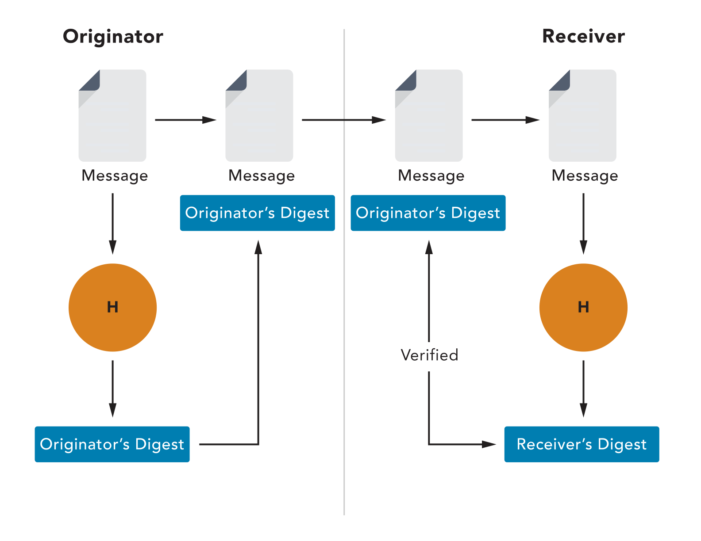

Chapter 5 Security Operations
---------
## Module 1: Understand Data Security
### Data Handling
* **Create**: Creating the knowledge, which is usually tacit knowledge at this point.
* **Store**: Storing or recording it in some fashion
* **User**: Using the knowledge, which may cause the information to be modified, supplemented or partially deleted.
* **Share**: Sharing the data with other users, whether as a copy or by moving the data from one location to another.
* **Archieve**: Archiving the data when it is temporarily not needed.
* **Destroy**: Destroying the data when it is no longer needed.

#### Data Handling Practices
* **Classification**:
	* Defination: Classification is the process of recognizing the organizational **impacts if the information suffers any security compromises** related to its characteristics of CIA.
	* Rules and restrictions about how that information can be used, stored or shared with others
	* "Is it secret?"
	* Potential impact or loss to the organization needs to be assessed
	* Derived from laws, regulations, contract-specified standards or other business expectations.
	* Lead to more efficient design and implementation of security processes
* **Labeling**:
	* Organizations are free to create classification systems 
	* **Highly restricted**: Compromise of data with this sensitivity label could **possibly put the organization’s future existence at risk**. Compromise could lead to substantial loss of life, injury or property damage, and the litigation and claims that would follow.
	* **Moderately restricted**: Compromise of data with this sensitivity label could lead to **loss of temporary competitive advantage**, loss of revenue or disruption of planned investments or activities.
	* **Low sensitivity (sometimes called "internal use only")**: Compromise of data with this sensitivity label could **cause minor disruptions**, delays or impacts.
	* **Unrestricted public data**: As this data is already published, **no harm** can come from further dissemination or disclosure.  
* **Retention**:
	* Information and data should be kept only for as long as it is beneficial, **no more and no less**.
	* Data retention policies are applicable both for hard copies and for electronic data.
	* Data destruction is being performed when an asset has reached its retention limit
	* Records retention policies indicate how long an organization is required to maintain information and assets.
	* Policies should guarantee that: 
		* Personnel **understand** the various retention requirements for **data of different types** throughout the organization. 
		* The organization appropriately documents the retention requirements **for each type of information**.
		* The systems, processes and individuals of the organization retain information in accordance with the required schedule but no longer. 
* **Destruction**:
	* **Remanence**: Data that might be **left on media after deleting**
	* Reduce the risk that data remanence could compromise sensitive information to an acceptable level
	* Can be done by several means:
		* **Overwriting/Zeroizing**: Writing multiple patterns of random values throughout all storage media 
		* **Purging**: 
		* **Physical Destruction**: Mechanically shredded, chopped or broken up, etched in acid or burned
		
### Logging and Monitoring Security Events
* Capture signals generated by events
* **Events**: Any **actions** that take place within the systems environment and **cause measurable or observable change** in one or more elements or resources within the system.
* Should include:
	* user IDs
	* system activities
	* dates/times of key events (e.g., logon and logoff)
	* device and location identity
	* successful and rejected system and resource access attempts
	* system configuration changes and system protection activation and deactivation events 
* Monitor health: Identifying inefficient or improperly performing systems, detecting compromises and providing a record of how systems are used. 
* log Review: security assessment, testing, security incidents, policy violations, fraudulent activities and operational problems.

#### Event Logging Best Practices
* **Ingress monitoring**: Surveillance and assessment of all inbound communications traffic and access attempts.
	* Firewalls
	* Gateways
	* Remote authentication servers
	* IDS/IPS tools
	* SIEM solutions
	* Anti-malware solutions
* **Egress monitoring**: Regulate data leaving the organization’s IT environment. Data loss prevention (DLP) or data leak protection.
	* Email (content and attachments)
	* Copy to portable media
	* File Transfer Protocol (FTP)
	* Posting to web pages/websites
	* Applications/application programming interfaces (APIs) 

### Encryption Overview
Encryption Provides:
* Confidentiality: Hiding or obscuring a message so that it cannot be understood by anyone except the intended recipient. 
* Integrity: Hash functions and digital signatures can provide integrity services that allow a recipient to verify that a message has not been altered by malice or error.

#### Symmetric Encryption
* Same key for both decryption and encryption
* Two parties communicating need to share knowledge of the same key.
* Distribution of the key is difficult
* Need to use a different key for each individual or group they want to connect with. This raises the challenge of **scalability**.

#### Asymmetric Encryption
* Uses one key to encrypt and a different key to decrypt the input plaintext
* Solves the problem of scalability
* Extremely slow compared with symmetric
* Encrypt with public key of receipient, decrypt with recipient private key
* Sign with sender private key, verify by sender public key

#### Hashing
* Takes an input set of data (of almost arbitrary size) and returns a fixed-length result called the hash value.
* Can create a message digest (digital signature to identify message interception)
* Useful: Easy to compute
* Nonreversible: Infeasible to reverse the hash process
* Content integrity assurance: Infeasible to modify a message and produce same hash value.
* Unique: Infeasible to find two or more different, sensible messages that hash to the same value.
* Deterministic: The same input will always generate the same hash, when using same hashing algor
* Checksums to detect accidental data corruption
* Calculate the digest of received message and compared. 

## Module 2: Understand System Hardening
### Configuration Management Overview
* A **process and discipline** used to ensure that the only **changes** made to a system are those that have been **authorized and validated**.
* **Identification**: Baseline identification of a system and all its components, interfaces and documentation.
* **Baseline**: A security baseline is a **minimum level of protection** that can be used as a reference point. Including **updates** to technology and architectures.
* **Change control**: An **update process** for requesting **changes to a baseline**, by means of making changes to one or more components in that baseline.
* **Verification and Audit**: A **regression** and validation process, which may involve **testing and analysis**, to verify that nothing in the system was broken by a **newly applied set of changes**.
* **Inventory**:  You can’t protect what you don’t know you have.

## Module 3: Understand Best Practice Security Policies
### Common Security Policies
#### Data Handling Policy
* Appropriate use of data: For use **within** the company, is restricted for use by **only certain roles** or can be **made public to anyone** outside the organization.
* Some legal usage definitions
* Example classifying credit card data as confidential can help ensure compliance with the PCI DSS

#### Password Policy
* Defines expectations of systems and users
* Password formulation
* Who is designated to enforce and validate the policy

#### Acceptable Use Policy (AUP)
* Defines **acceptable use of the organization’s network and computer system** and can help **protect the organization from legal action**.
* Appropriate and approved usage of the organization’s assets
* Each employee should be required to sign a copy of the AUP
* Policy aspects commonly included in AUPs:
	* Data access
	* System access
	* Data disclosure
	* Passwords
	* Data retention
	* Internet usage
	* Company device usage

#### BYOD Policy
* All employees must read and agree to adhere to this policy before any access to the systems, network and/or data is allowed.

#### Privacy Policy
* Similar to the AUP but is specific to **privacy-related data**. 
* Personnel need to **understand and acknowledge the organization’s policies** of handling PII
* Which information is considered PII/ePHI
* Appropriate handling procedures and mechanisms used by the organization
* Punitive measures for failure to comply
* Should also create a public document that explains how private information is used, both internally and externally. 

#### Change Management Policy
* The discipline of transitioning from the current state to a future state.
* A process to implement the **necessary changes** so they **do not adversely affect business operations**. 

#### Change Management Components
* Request for Change (RFC)
* Approval
* Rollback

## Module 4: Understand Security Awareness Training
### What is Security Awareness Training?
Three different types of learning activities:
* Education: Improve their understanding of these **ideas and their ability to relate them** to their own experiences and apply that learning in useful ways.
* Training: Building **proficiency in a specific set of skills or actions**
* Awareness: Attract and engage the learner’s **attention** by acquainting them with aspects of an issue, concern, problem or need.
